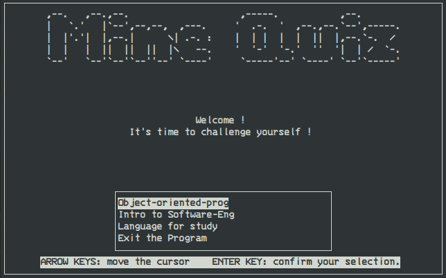

# MineQuiz

> **A cpp project for Object-oriented programming course in UNI_ADL.**

> 
----
## Introduction

The "MineQuiz" is inspired by the phone APP "Quizlet". You can store your questions into three differen subjects (OOP, ISE, LFS). Help you easily review your own questions at any time.
## How to run it? (for Mac, Ubuntu and RedHat)

#### 1. Download "ncurses" Libary in your computer

> On Ubuntu

`$ sudo apt-get install libncurses5-dev libncursesw5-dev`

> On RedHat

`$ sudo yum install ncurses-devel`

> MacOs-(using homebrew)

`$ brew install ncurses `

#### 2. Clone MineQuiz on your computer

`$ git clone https://github.com/a1779748/MineQuiz.git`

#### 3. Enjoy it

> Enter the following code in the root directory of the repository

`$ make run`

## Detail about this project
> Please go to Readme/PDF

## Contact  me

If you find any problems or code that could be improved, feel free to submit an issue!

Since I'm not yet familiar with github, I'll try to fix any requests that are made.

Anyway, if you're not as familiar with github as I am, but have found the problem, below is my email address, please contact me.

> <wwmogu@gmail.com>
