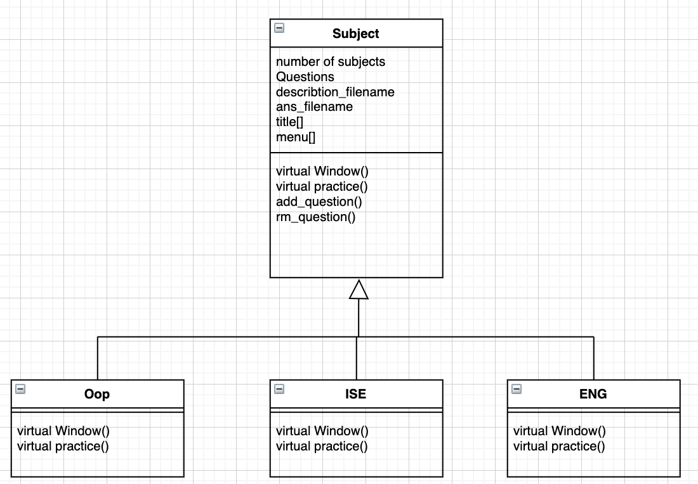
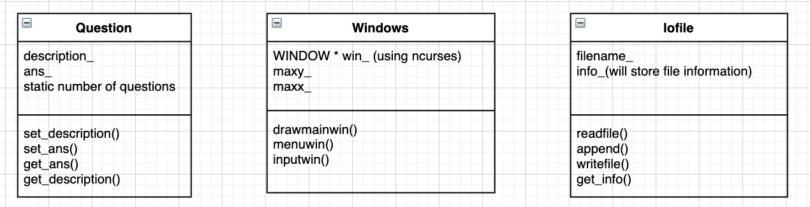

> **Dong Wang  a1779748**

> **-OOP S2, 2020**

> **-The University of Adelaide**

----
# Project Specification - Major Practical

## Introduction

The "MineQuiz" is a self-learning helper, which can store your own questions into specific subject. Help you easily review your own questions at any time!
## Design Descirption
### Assessment Concepts
#### Memory allocation from the stack and the heap
* Array: The subject title will store in an array which is on the stack.
* Vector: For efficient growth the size of a question list, I will use the vector to save the question from the file.
* Strings: Filename and "Questions" will use the string data type to store.
* Objects: 
    * SuperClass-Subject{OOP, ISE, ENG - SubClass}
    * Iofile Class
    * Windows Class - using ncurses
#### User Input and Output
* file IO - using fstream
* user input up,down,left,right key - using ncurses [keypad(), getch()].
* user input "Questions" or remove a "Question" - using ncurses [getch()].
* all of the screen output will using ncurses printw(), which is like printf() in c.
* some of TestProgram will using iostream.
#### Object-oriented programming and design
* Inheritance
    * the OOP, ISE, ENG class will inheritance from the Subject class.
* Polymorphism and Abstract class
    * since each specific subject will have their own title and their own Questions, I will write two pure virtual function(windows and practice) in Subject class, trate it to an abstract class.
#### Class Diagram

#### Class Describtion
the detile of each class will be commented in the program.

## Testing Plan
Since the user input is uncertain, my testing will be perform manually.
### Component test
for each Function in an class I will keep track of them then collect functions into its Class.
### Unit test
for each Class I will write a sigle Testfile corrdinate to each of them.

### System test

once a Unit test finish, I will collect them into final System test file and test whether it will works.
## Schedule Plan
add code into my Makefile when the new Test file created.
### Week 8
draw a bluepoint for the whole project, and delect some of features that is difficut to implement.
### Break Week 1
Create a project prototype to achieve the final look of the project.
### Break Week 2
implement the Iofile, Windows and Question class.
### Week 9
Finish one of the Subject which is Oop, and make the whole program excutable.
### Week 10
Finish ENG and ISE Subject, add all tested code into Main file also make it excutable.
### Week 11
Since the time is limted, in this week, I only double check if my main program works fine and if time is enough i will add some user prompt and color in my final version.