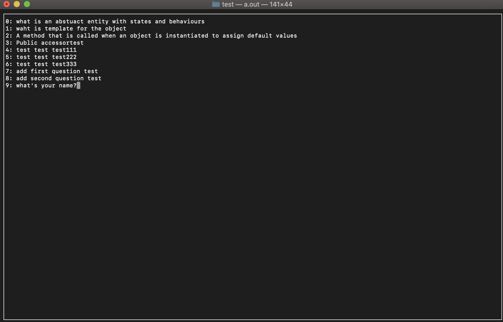
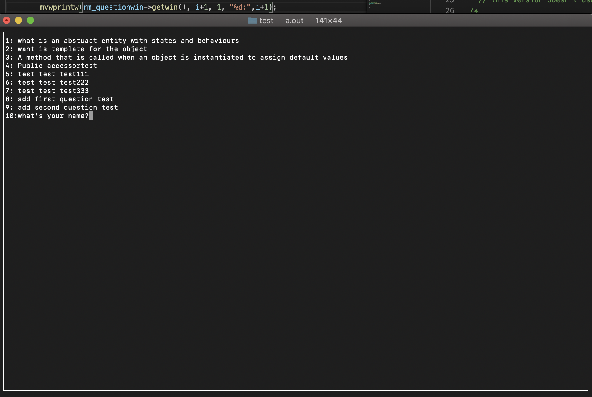
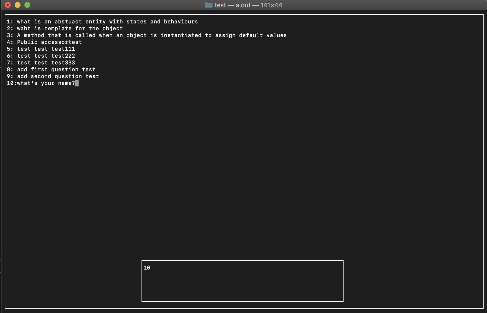
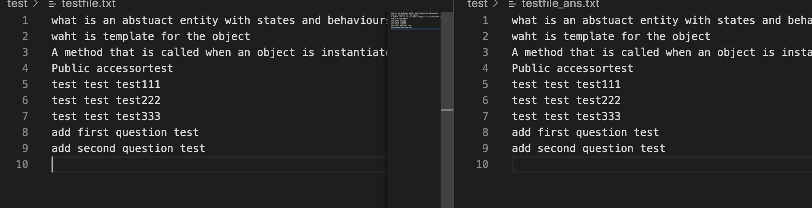
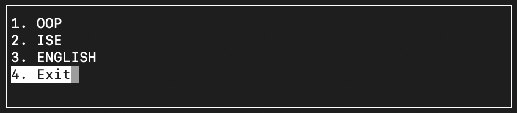
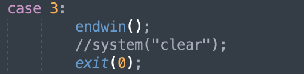
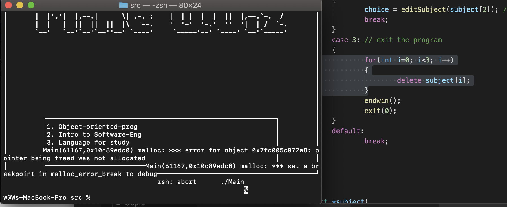
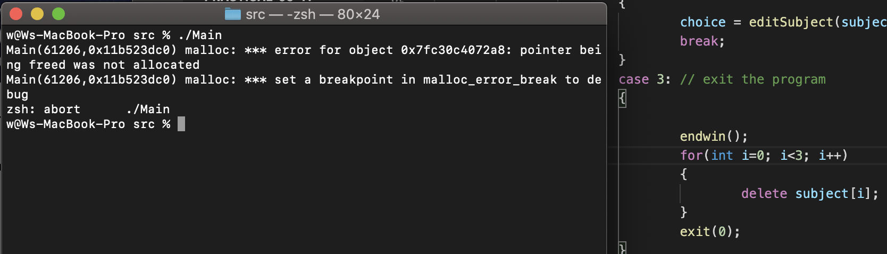

# Sep 30, Wed

## Oop "practice" part

### develope

1. when user choose "practice" they, they can Self-practice adding questions in the order in which they are stored.

### test

1. Test each window could show the interface propely

2. Check if user reached the last question

3. Check if the user at first question but still want to see previous one

# Oct 1st, Thursday

## Add question part for each subject(all subjects will have this function)

### develope 

1. Finish add_question function in class subject, but do not make the windows for it.
2. add a new function write_file()
3. Change the old writ file function to append() function;

### test

1. do not have test

# Oct 2nd, Friday

## continue yesterday

### develop

1. add a new function into windows class which will create an input window.(user input will show in this window)
2. Create add_questionTest , testing whether the user input will add into file
3. Start doing remove question function in subject class(only write down the steps).
4. Finish source makefile
5. Upload on svn and test on ubuntu.

### test

1. Manually test adding question into file (got a bug, not figure yet, when user input reach to second line, and they want to delete, the windows will break); so, delete that code block, user can not change the previous line text.
2. Add this new function to systemTest file, it works fine.

# Oct 3th, Saturday

## plan to finish the last main component for Subject which is remove question

### develop

1.  list all questions with ID which is the index of the vector
2. choose the ID that user want to remove (function 2)
3. update the corrdinate file by rewriting the whole file (function 3)

### test

1. Test list all question description shown on the screen (ID need to change)

   Change the ID

2. Test remove question function (function 2 and 3)





Remove works fine------------(the answer file break, need change the get_describtion to get_ans())

The "10" index looks not good(need to fix), and need some prpmpts for user delete one question(example, 1.prompt user input numbers if not numbers or the number out of bound, notice user re enter 2. When user choose one question, double check that user want to delete that one. 3. when user delete successful prompt user.)(==not like specific, but fixed==)

# Oct 7th, Wednesday

## Plan to finish the Oop class make the whole program can work.

### develop

Figure out the mistake in the rm_question function(get_ans(), overwrite the answer file).

Figure out the "10" index looks not good, now if the index not greater than three decimal, it will always works fine.

Add the rm_question() function into SystemTest.

add std=c++11 for Makefile in test directory 

### test

No test today.

# Oct 11st, Sunday

## Plan to rebuild an well-structed makefile, and move the test version to final version, also add ISE class to final version

### develop

1. add a new function at the main window, when user choose this one, the program will end.

   

2. finish the ISE subject

   * the practice method did not add the new features
   * The Windows method did not add the new features

3. add the ISE commond line into Makefile 

4. add the ISE into src main program (with bugs.)

5. add questions into txt->Ise_A/Ise_D

6. finish the LFS subject

   * no new features
   * no fix bugs

7. Add the LFS commond line into Makefile

8. Add the LFS subject into main program without debug.

### test

1. Testing the exit function by choose that one manually

   a. In the SystemTest.cpp if there is no `endwin()`, the terminal will break.

   b. `system("clear")`is for clear the screen.

   

2. test ISE IseTest.cpp see if it works.(manually test)
3. Add it to SystemTest.cpp see if it works fine too
   * Window new, ise new, oop new, there is memory leak problem(fixed)
   * Both add and delete function in two subjects cannot exit.(fixed)

4. Test LFS LfsTest.cpp (manually test)

# Oct 12nd, Monday

Discuss the first version in Workshop-10

1. Pure-virtual means every subclass has different behaviour
2. Virtual means some of subclass has different behaviour
   * based on 1 and 2, window, practice behaviour need to change (changed)

3. In main function, there are lots of repeated code, so that add a function reduce that repeat code.
4. About the flashing of the symbols, it needs to be changed and not seen by the user
5. For memory allocation, using a pointer `Subject *subject[3]`

# Oct 13th, Tuesday

## Plan to finish all of the problems from Oct 12nd.

### develop

1. Change in main driver (MineQuizMain.cpp), add an function named editSubject(), which will reduce the repeated code
2. Create `Subject *subject[3]`before using it, instead of creating subject many times.
3. in menuwin  add `curs_set(0);` to hide the cursor.
4. In input win add `curs_set(1);`to show the cursor.
5. Removed all inoperable or buggy code that was commented out to improve readability.
6. Add user prompt and welcome into main window and three subject window.
7. in OOP and ISE, using color_pair make the flashcard looks better. 
8. add the different function into LFS subject, which change the flash card to word test .
9. In add_question & re_question function, when user type "exit it" will exit this function.

### test

1. for free the memory of subjects, add the following code (fixed).

```c++
for(int i=0; i<3; i++)
{
	delete subject[i];
}
```

But, do not know when can I free the memory, these code will cause an error when I exit the program, shown as below

Bug Case 1: (add the free code before endwin())

> 

Bug Case 2: (add the free code after endwin())

> 

2. Test the exit new features in LfsTest.cpp (manually test).
3. Test the new LFS practice in systemTest.cpp it works fine, but in MineQuizMain.cpp it couldn't work.
   * Trace back to source code, the only different of these two program is the question file.
     * the problem is LFS_D and LFS_A are empty.

# Oct 18th, Sunday

## plan to fix all exist bugs

### develope

1. Fix "arrow key tips" position problem
2. Adding unit test for "Question", "Iofile" and both of them(ReadQAformfileTest.cpp).
3. add prompt into subject class add_quesiton()
4. Fix inputwin cannot "back to last line" bug.

### test

1. only test input win mannully
   * for the delete question part, can not enter words, if so the program will break.

# Oct 21st, Wednesday

1. fix the memory delete bug in MineQuizMain.cpp.

2. Move all windows variable into the subject class, make that variables become attributes

   easy to manage the memory.
   
3. move the editSubject function into a seprate file.


------------------------------------------Ready to Cheak----------------------------------------------------------------